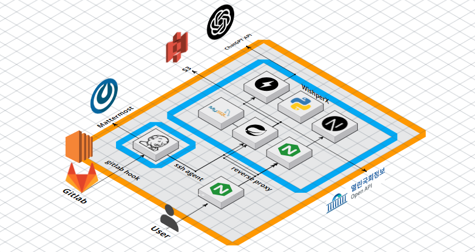

# 🐝여의도 꿀통🐝

---

## 💡서비스 소개

---

> 이전에 여러분이 행사한 "소중한 한 표"로 당선된 국회의원들의 활동이 궁금하진 않으신가요?
우리가 선택한 국회의원이 지금까지 어떤 행보를 해왔으며, 약속한 공약을 이행했는지 확인할 시간이 왔습니다.

🐝**여의도 꿀통**🐝을 통해 여러분이 권리를 행사하는 데 필요한 모든 정보를 손쉽게 찾아보세요!

✨ 단순히 정보를 전달하는 것을 넘어, 다음 선거에서 더 의미 있는 한 표를 행사할 수 있도록 도움을 줍니다.
✨ 우리가 행사하는 투표가 실제로 어떤 영향을 미치며, 일상에서 어떻게 반영되는지 직접 확인해 보세요.
>

## 🔎기획배경

---

"여의도 꿀통"은 선거 후 관심도가 떨어지는 문제, 정치의 복잡성, 그리고 지지할 정당이나 정치인의 부재로 인한 무관심을 해결하기 위해 기획되었습니다.

이 서비스는 투표 이후에도 꾸준히 정치에 관심을 가질 수 있도록 돕고, 정치적 결정 과정을 보다 쉽고 이해하기 쉬운 형태로 제공함으로써, 정치에 대한 접근성을 높이고자 했습니다.

## 🗓️프로젝트 진행 기간

---

### ▪️2024.02.26 ~ 2024.04.04

## 🖥️아키텍처

---

## ⚙️기술 스택

---

### Infra

- Nginx1.18.0
- Jenkins 2.440.1
- Sonarqube 10.4.1

### BackEnd

- JAVA 17
- SpringBoot 3.2.3
- MySQL 8.3
- Python 3.10.14
- FastAPI 0.110.0

### FrontEnd

- Next 14.1.3
- React 18
- Vanilla-extract 1.14.1

## 🛠️협업 툴

---

- Git
- Jira
- Notion
- Figma
- ERDcloud
- Webex
- Mattermost
- GA4
- Beusable

## 📋ERD

---

## 📕주요 기능 및 데모영상

---

### 1. 국회의원 별 정보

- 지역 별로 국회의원을 검색할 수 있다.
- 국회의원에 대한 정보를 알 수 있다 (공약, 발의한 법안, 약력, 출석률)

### 2. 정당 별 정보

- 정당 평균 출석률을 확인할 수 있고, 정당에 속해 있는 국회의원 출석률을 비교할 수 있다.
- 정당에서 가장 많이 발의한 분야를 알 수 있다.

![정당-상세조회]](images/정당-상세조회.gif)

### 3. 법안 별 정보

- 내가 보고 싶은 법안의 추진 현황을 볼 수 있다.
- 분야 별로 법안을 볼 수 있고, 읽기 어려운 법안 내용을 요약해서 볼 수 있다.

### 4. 입문서

- 어렵고 복잡한 용어를 이해하기 쉽게

### 5. 뉴스

- 국회에 대한 최신 뉴스를 볼 수 있습니다.
- 국회 라이브 영상을 주제 별로 요약 영상을 볼 수 있습니다.

### 6. 22대 총선 정보

- 후보자들의 약력과 공약을 볼 수 있다.

### 7. 선거구 위치

- 내가 살고 있는 곳에서 가까운 선거구를 찾을 수 있다.

## 👨‍👩‍👧‍👧팀 구성

---

### 유재건
조성규
강건
김가빈
김성제
권준구
